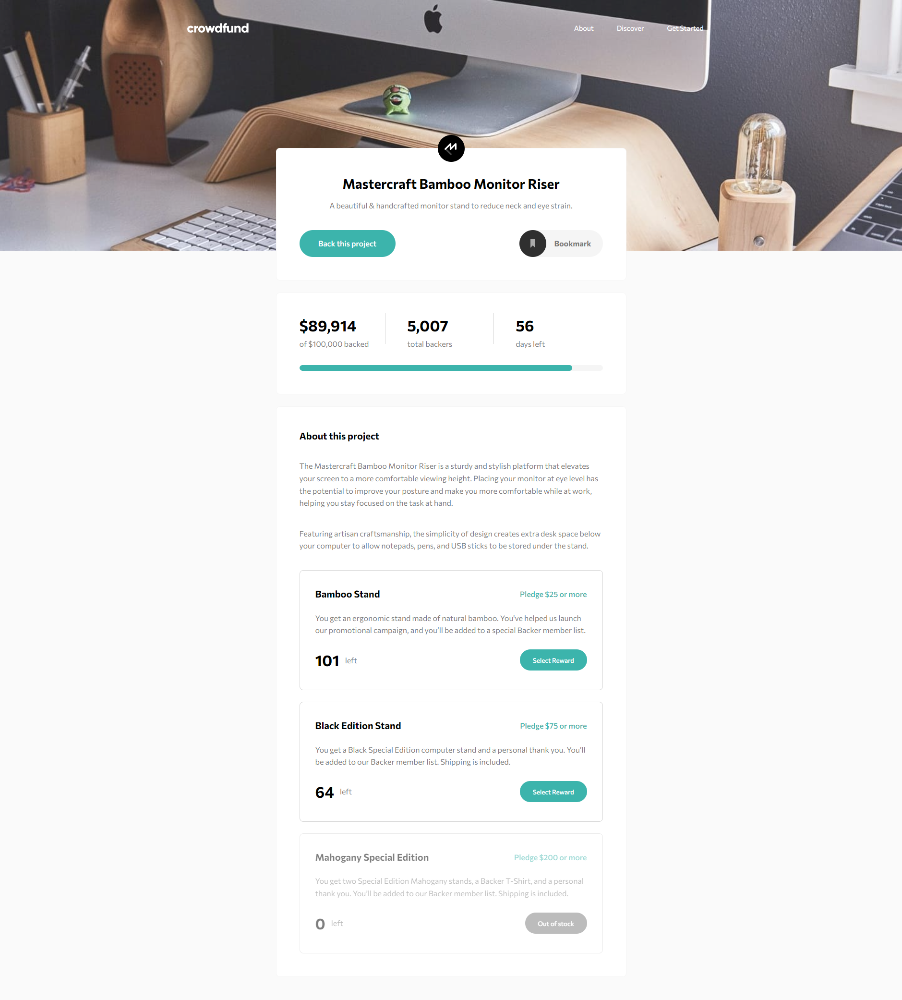

# Frontend Mentor - Crowdfunding product page solution

This is a solution to the [Crowdfunding product page challenge on Frontend Mentor](https://www.frontendmentor.io/challenges/crowdfunding-product-page-7uvcZe7ZR). Frontend Mentor challenges help you improve your coding skills by building realistic projects.

## Table of contents

- [Overview](#overview)
  - [The challenge](#the-challenge)
  - [Screenshot](#screenshot)
  - [Links](#links)
- [My process](#my-process)
  - [Tools used](#tools-used)
  - [What I learned](#what-i-learned)
  - [Continued development](#continued-development)
  - [Useful resources](#useful-resources)
- [Author](#author)

## Overview

### The challenge

Users should be able to:

- View the optimal layout depending on their device's screen size
- See hover states for interactive elements
- Make a selection of which pledge to make
- See an updated progress bar and total money raised based on their pledge total after confirming a pledge
- See the number of total backers increment by one after confirming a pledge
- Toggle whether or not the product is bookmarked

### Screenshot

### Links

- Live Site URL: [Crowdfunding product page](https://your-live-site-url.com)

## My process

### Tools used

- Semantic HTML5 markup
- SCSS
- SCSS variables
- SCSS mixins
- Flexbox
- Grid
- Mobile-first workflow
- [React](https://reactjs.org/) - JS library
- [Sass](https://sass-lang.com/) - For styles
- [PostCSS](https://postcss.org) - For CSS prefixes
- [ESlint](https://eslint.org) - For code linting
- [Vite](https://vitejs.dev) - Project building ttool

### What I learned

This project was a good exercise to practice some React concepts and APIs like **Context and Refs**, as well as to remember some Sass aspects such as **partials**, **maps**, etc.
I also learned how to configure ESlint in a simple way to help me find code errors more easily.

### Continued development

I find my React code a little hardcoded, one of the aspects I want to keep developing is my problem-solving techniques techniques. I also think my SCSS code can be improved by writing less code and reusing more classes, that's why I like to watch other people with more experience solving problems with different approaches than mine.

### Useful resources

- [CÓMO configurar ESLINT y PRETTIER en REACT](https://www.youtube.com/watch?v=3BHXuZvI4FI) - This video helped me to configure my ESlint

## Author

- Frontend Mentor - [@Jorge-sanchez09](https://www.frontendmentor.io/profile/Jorge-sanchez09)
